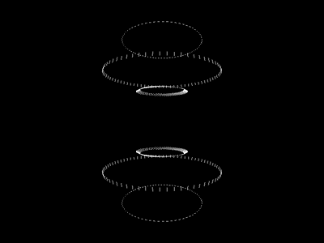

# Ships

Small project for drawing animations of objects orbiting the earth, as seen in an Earth-centered, Earth-fixed frame (ECEF).

This is based on the same principle as [erdorbit](https://github.com/tvoirand/erdorbit), but developed using pygame, and more focused on animations.

See more examples on [thibautvoirand.com/ships](https://thibautvoirand.com/ships).
